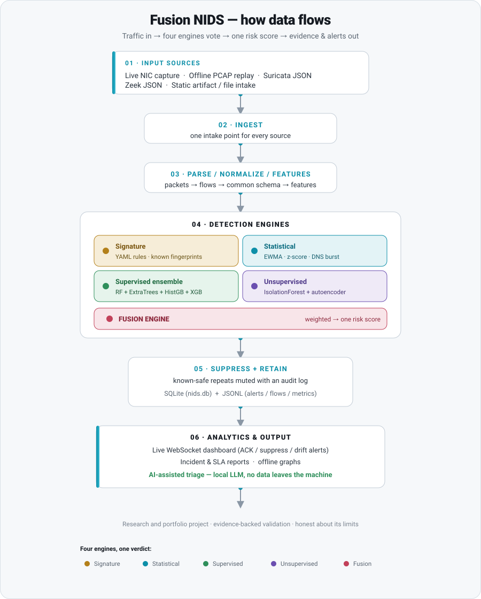

# Fusion NIDS

**A hybrid, multi-engine network intrusion detection system with evidence-backed validation.**

[](https://github.com/s-shahzad/fusion-nids/actions/workflows/ci.yml)


Fusion NIDS inspects network traffic and flags suspicious activity using four detection methods at once, then blends their verdicts into a single risk score. It works on live traffic or recorded captures, keeps the evidence behind every alert, and ships with a live dashboard plus optional AI-assisted triage that runs locally and never sends your data off the machine.

It is a research and portfolio project. The goal is to show not only what it detects, but how it behaves under realistic conditions and where its current limits are.

<p align="center">
  
</p>

---

## In plain terms

Think of a security guard for your network. Every packet of traffic is a person walking toward a door. The guard checks each one four different ways, a rulebook of known-bad fingerprints, a sense of what "normal" looks like, a trained model, and a detector for anything simply unusual, then combines those checks into one score and raises an alert only when it should. Fusion NIDS is that guard, plus the camera feed (a live dashboard), the logbook (stored evidence), and the incident write-up (reports and local AI triage).

---

## How it works

```
+--------------------+      +--------------------+      +---------------------------+
|    INPUT SOURCES   | ---> |    INGEST LAYER    | ---> |  PARSE / NORMALIZE        |
|--------------------|      |--------------------|      |---------------------------|
| Live NIC capture   |      | Live capture       |      | Packet parsing            |
| Offline PCAP replay|      | Offline replay     |      | Flow normalization        |
| Suricata JSON      |      | Adapter ingest     |      | Event shaping             |
| Zeek JSON          |      | Artifact intake    |      | Common schema output      |
| Artifact / file    |      +--------------------+      +-------------+-------------+
+--------------------+                                                |
                                                                      v
                                                    +---------------------------+
                                                    |    FEATURE EXTRACTION     |
                                                    +-------------+-------------+
                                                                  |
                                                                  v
                                          +-------------------------------------------+
                                          |           DETECTION ENGINES               |
                                          |-------------------------------------------|
                                          |  Signature rules (YAML)                   |
                                          |  Statistical anomaly (EWMA / z-score)     |
                                          |  Supervised ensemble (RF + ET + HGB + XGB)|
                                          |  Unsupervised (IsolationForest + AE)      |
                                          |  Fusion engine (combined risk score)      |
                                          +-------------------+-----------------------+
                                                              |
                                                              v
                                    +-----------------------------------------------+
                                    |        SUPPRESSION + RETENTION                |
                                    |-----------------------------------------------|
                                    |  Alert suppression with audit log             |
                                    |  SQLite (nids.db) + JSONL (alerts / flows)    |
                                    +-------------------+---------------------------+
                                                        |
                                                        v
                               +---------------------------------------------------+
                               |           ANALYTICS + REPORTING                   |
                               |---------------------------------------------------|
                               |  Live dashboard (WebSocket + HTTP fallback)       |
                               |  Offline graphs and visual analytics              |
                               |  Incident / SLA / threshold tuning reports        |
                               |  AI-assisted triage (local LLM, no data egress)   |
                               +---------------------------------------------------+
```

Stage by stage:

1. **Input sources.** Read traffic live off a network card, replay it from saved PCAP files, ingest Suricata or Zeek JSON, or hand it a file to inspect.
2. **Ingest.** Every source feeds into one intake point.
3. **Parse and normalize.** Packets become flows (conversations between two machines) reshaped into one common schema so every later step reads the same fields.
4. **Detection engines.** Four engines score each event: signature rules, statistical anomaly, a supervised ensemble, and an unsupervised detector. A fusion step blends them into one risk score.
5. **Suppress and retain.** Alerts, flows, and metrics are written to SQLite and JSONL. Known-safe repeats are suppressed with an audit trail so analysts are not buried.
6. **Analytics and output.** A live dashboard, offline graphs, incident and SLA reports, and optional local-LLM triage. No data leaves the machine.

---

## The detection engines

| Engine | Method | Catches |
|--------|--------|---------|
| Signature | YAML rule matching | known attacks with a fixed fingerprint |
| Statistical | EWMA, z-score, DNS burst | sudden spikes against a learned baseline |
| Supervised | ensemble of RandomForest, ExtraTrees, HistGB, XGBoost | attack patterns learned from labeled data |
| Unsupervised | IsolationForest, autoencoder | novel or unlabeled odd behavior |
| Fusion | weighted risk scoring | combined confidence across all four |

---

## Capabilities

| Area | What is supported |
|------|-------------------|
| **Ingest** | Live NIC capture, offline PCAP replay, Suricata/Zeek JSON adapters |
| **Artifact analysis** | Static triage without file execution: PE, PDF, Office, script |
| **Detection** | Signature rules, statistical anomaly, supervised ensemble, optional unsupervised, fusion scoring |
| **Retention** | SQLite, per-run JSONL (alerts, flows, metrics), trained model pickle |
| **Dashboard** | Live WebSocket dashboard with incident ACK/suppress, sensor comparison, anomaly trend bands, drift alerts, URL-persistent filters |
| **Reporting** | Incident reports, weekly SLA summaries, threshold tuning guidance, visual analytics |
| **AI triage** | Local LLM triage against an existing run folder, no data leaves the machine |
| **Lab** | Adversary replay scenarios via `adversary_lab` (optional, GPL-licensed, see [Licensing](#licensing)) |

---

## Quickstart

### Prerequisites

- Python 3.10 or newer
- Linux or Windows (live capture requires appropriate privileges)

### Install

```bash
git clone https://github.com/s-shahzad/fusion-nids.git
cd fusion-nids
python -m venv .venv
# Linux/macOS
source .venv/bin/activate
# Windows
.venv\Scripts\activate

pip install -r requirements.txt
```

### Run offline against a PCAP directory

```bash
python -m nids run --pcap-dir pcaps --rules rules/rules.yml
```

### Run live capture

```bash
# Linux (requires elevated privileges for packet capture)
sudo python -m nids run --interface eth0 --rules rules/rules.yml
```

### Run the full hybrid stack (signature + anomaly + supervised + unsupervised)

```bash
python -m nids run --pcap-dir pcaps --labels pcaps/labels.csv --unsupervised
```

### Open the live dashboard

```bash
python -m nids dashboard --from-db output/nids.db --host 127.0.0.1 --port 8000
```

Then open `http://127.0.0.1:8000/dashboard` in your browser.

### Generate an incident report

```bash
python -m nids report --from-db output/nids.db --out reports/summary.md
```

### Run AI-assisted triage on an existing run folder (local LLM, no egress)

```bash
# Windows
.\nids-triage.cmd "output\<run-folder-name>"
# Output: triage_<run>.json + triage_<run>_report.md in the same folder
```

### Train and evaluate the supervised ensemble model

```bash
python -m nids train --from-db output/nids.db --out models/model.pkl
python -m nids evaluate --from-db output/nids.db --model models/model.pkl --out reports/ml_evaluation.json
```

---

## Validation snapshot

This project treats validation as a first-class output. The current baseline:

| Measure | Result |
|---------|-------:|
| Test suite collected | 152 |
| Default suite result | 144 passed, 8 deselected |
| Active pytest warnings | 0 |
| Coverage | 79.16% |
| Coverage floor (enforced) | 72% |
| Latest offline lab scenario passes | 5 |
| Latest prepared-environment passes | 10 of 17 manifests |
| Benign soak (tuned) | 1,416 flows, 0 alerts |
| Soak pilot | 4,742 flows, 0 alerts, 13.3s restart latency in a 900s pilot |

**Selected prepared-environment highlights:**

- `PREP-ENV-003`: retained queue-depth and packet-loss evidence (99.7% loss under pressure, correctly accounted)
- `PREP-ENV-005`: false-positive adjudication, applied a targeted unsupervised-tuning change, reran 1,416 benign flows, reached 0 alerts
- `LAB-SCN-005`: combined network and artifact evidence, 7 flows, 1 network alert, 4 artifact rows, 2 quarantined high-risk artifacts

---

## What this repo is not

This is a research and portfolio project, not a production security product. Specifically:

- Not validated for zero-downtime production operation
- Not yet validated with a full-duration benign soak at production traffic volume
- Not enterprise-supported or commercially maintained
- The live dashboard and API are designed for **local use only** (127.0.0.1). Do not expose them without adding authentication middleware.

---

## Documentation

| Document | Description |
|----------|-------------|
| [Project one-pager](docs/project_one_pager.md) | Summary, architecture, and metrics |
| [Showcase story](docs/showcase_story.md) | What makes this different from a typical IDS demo |
| [Validation master record](docs/testing_validation_master.md) | Full test and scenario evidence |
| [False-positive analysis](docs/false_positive_analysis.md) | Tuning decisions and adjudication log |
| [Deployment readiness checklist](docs/deployment_readiness_checklist.md) | Current readiness gate status |
| [Evidence inventory](docs/evidence_inventory.md) | What evidence exists and where |

---

## Contributing

Contributions are welcome. See [CONTRIBUTING.md](CONTRIBUTING.md) for setup, tests, and the pull-request process, and [CODE_OF_CONDUCT.md](CODE_OF_CONDUCT.md) for community expectations.

---

## Roadmap

- [ ] Full-duration benign soak validation
- [ ] Broader benign traffic adjudication corpus
- [ ] Suppression-specific live evidence run
- [ ] Maintenance workflow decision (hot-reload vs restart)
- [ ] Public demo assets (curated screenshots, sample run outputs)

---

## Related research

The author is first author on IEEE-published research in ML-based attack detection:

> "Plugged-in and Protected: Using ML to Secure IoT-Based EV Charging Stations from DoS Threats." IEEE GCAIoT 2025. DOI: [10.1109/GCAIoT68269.2025.11275540](https://doi.org/10.1109/GCAIoT68269.2025.11275540)

---

## Licensing

The core detection engine and API (`src/NIDS/` excluding `adversary_lab/`) are licensed under the **MIT License**, see [LICENSE](LICENSE).

The `src/NIDS/adversary_lab/` component depends on [Scapy](https://scapy.net) (GPL-2.0-only) and is therefore licensed under **GPL-2.0-or-later**, see [src/NIDS/adversary_lab/LICENSE](src/NIDS/adversary_lab/LICENSE). This component is optional and not required to run the core detection pipeline.

---

## Security

To report a vulnerability, see [SECURITY.md](SECURITY.md). Please do not open a public issue for security problems.
